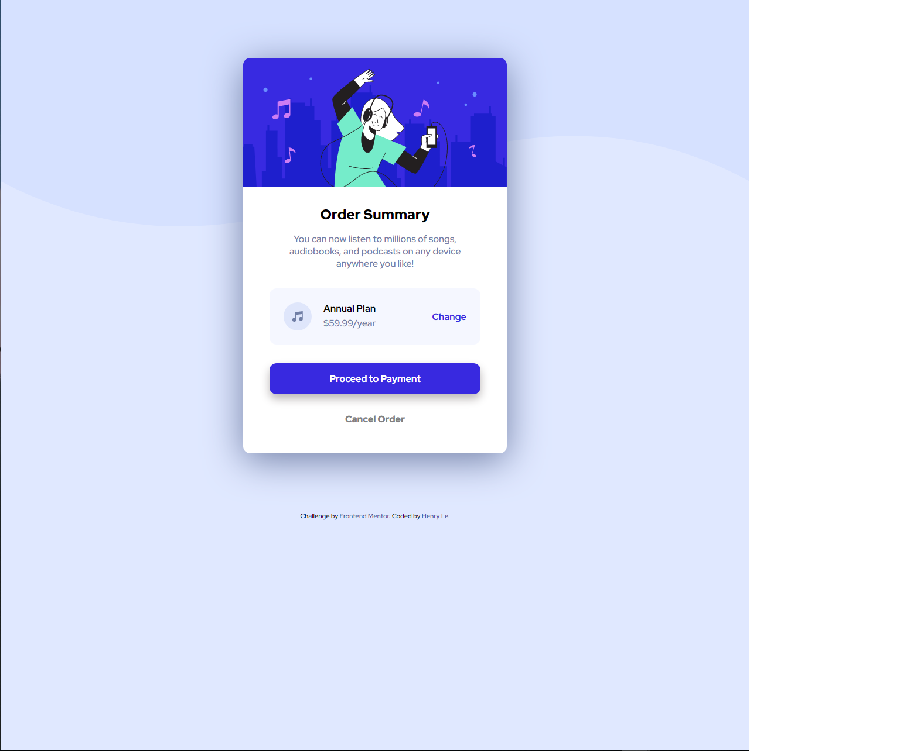

# Frontend Mentor - Order summary card solution

This is a solution to the [Order summary card challenge on Frontend Mentor](https://www.frontendmentor.io/challenges/order-summary-component-QlPmajDUj). Frontend Mentor challenges help you improve your coding skills by building realistic projects. 

## Table of contents

- [Overview](#overview)
  - [The challenge](#the-challenge)
  - [Screenshot](#screenshot)
  - [Links](#links)
- [My process](#my-process)
  - [Built with](#built-with)
  - [What I learned](#what-i-learned)
- [Author](#author)


**Note: Delete this note and update the table of contents based on what sections you keep.**

## Overview

### The challenge

Users should be able to:

- See hover states for interactive elements

### Screenshot



### Links

- Live Site URL: [CLICK HERE](https://henrysama58.github.io/Order-summary-component-challenge-hub/)

## My process

- Code from the outside to inside.

### Built with

- Semantic HTML5 markup
- CSS custom properties
- Flexbox
- CSS Grid
- Mobile-first workflow

### What I learned

I learned how to manipulate containers and use hover states.

```html
        <div class="payment-buttons">
          <div class="proceed-button">
            <p class="proceed-button-content">Proceed to Payment</p>
          </div>
          <div class="cancel-button">
            <p class="cancel-button-content">Cancel Order</p>
          </div>
        </div>
```
```css
.plan-container {
    display: flex;
    align-items: center;
    background-color: hsl(225, 100%, 98%);
    width: 360px;
    padding: 24px;
    justify-content: space-between;
    border-radius: 12px;
}
```

## Author

- Website - [Henry Le](https://henryle.org/)

